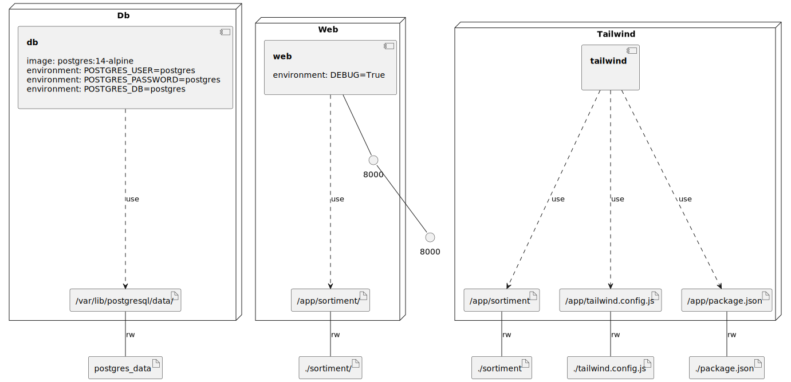

<div align="center">
    
    <h3>Sortiment</h3>
    <p>Systém na správu bufetov</p>
</div>

## Čo to je?

Sortiment je systém, ktorý spravuje nákup, management skladu, kredity a iné
funkcionality Trojstenových interných bufetov. 

## Prerekvizity

- [Python 3.12](https://www.python.org/downloads/)
- [Pipenv](https://pypi.org/project/pipenv/) (`pip install pipenv`)
- [Docker](https://docs.docker.com/engine/install/)
- [docker-compose](https://docs.docker.com/compose/install/)
- respektíve [Docker Desktop](https://www.docker.com/products/docker-desktop) na Windowsoch

## Spúštanie

```bash
docker-compose up # spustenie serveru
docker-compose run --rm web python manage.py createsuperuser # vytvorenie admin pouzivatela
```

### Konfigurácia miestnosti

1. Otvor stránku [localhost:8000/admin](http://localhost:8000/admin/)
2. *Warehouses* → *Pridať*
3. Skopírovať IP adresu z: Vpravo Django bar → *Hlavičky* → `WSGI prostredie` → `REMOTE_ADDR`
4. Vpravo hore tlačidlo X, vyplň údaje a uložiť


### Správa sortimentu

1. [localhost:8000/store/products/](http://localhost:8000/store/products/)

alebo

1. [localhost:8000](http://localhost:8000/store/)
2. Zvoliť konto s právami (admin používateľ)
3. Ikona ceruzky

### Infrastructure model

- [web component model](.infragenie/web_component_model.svg)

---
